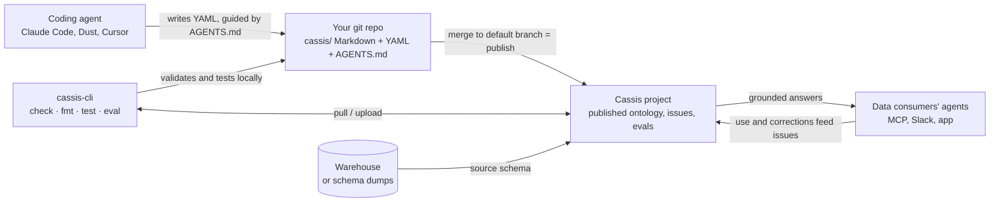

# Adding new domains and context to your Cassis ontology

This guide is for teams with a live Cassis project who want to extend coverage themselves: new schemas, new domains, richer business context. It shows how to turn the context you already have (schema dumps, dbt YAML, query history, internal docs, agent skills) into ontology files, with a coding agent like Claude Code doing the bulk of the writing and you reviewing.

You will use three tools together:

- **Your git repository**, where the ontology lives as Markdown domain docs plus YAML data files (see [Ontology in git](https://docs.getcassis.com/git/))
- **cassis-cli**, to validate, test, and publish (see [CLI reference](https://docs.getcassis.com/cli/))
- **A coding agent**, guided by `cassis/AGENTS.md` and the prompts below

If your agent is Claude Code, skip the copy-paste prompts: install the [`cassis-ontology-authoring` skill](https://github.com/GetCassis/skills) (`/plugin marketplace add GetCassis/skills`, then `/plugin install cassis-ontology-authoring@cassis`) and it runs this whole workflow, preflight checks and validation included. The prompts below are for agents that can't install skills (Dust, Cursor, claude.ai).

## How the pieces fit



Everything on the left is yours: the YAML in your repo is the source of truth, your agent writes it, the CLI checks it without touching production. Nothing reaches your data consumers until a merge to the default branch publishes a new version. Real use then flows back as issues, which is where the maintenance loop (end of this guide) picks up.

## What the ontology is made of

| File | What it holds |
|---|---|
| `cassis/project.yml` | Project id and format version |
| `cassis/domains/README.md` | The root domain: high-level context for the whole ontology |
| `cassis/domains/<path>/README.md` | A business domain, as a Markdown doc: frontmatter for the structured fields, a body that explains the domain, routes between tables, and links topic docs |
| `cassis/tables/<schema>/<table>.yml` | One table: grain, description, columns with descriptions and synonyms |
| `cassis/metrics/<name>.yml` | One metric: definition, SQL, grain |
| `cassis/joins.yml` | All join paths, centralized |

Domains are Markdown documents in [OKF (Open Knowledge Format)](https://github.com/GoogleCloudPlatform/knowledge-catalog/tree/main/okf), so they render natively when you browse the repo. Tables, joins, and metrics stay YAML: they're data, not documents. Full field-by-field reference: [file format](https://docs.getcassis.com/file-format/). For a complete example of what "done" looks like, read the [Stallora ontology](https://github.com/GetCassis/cassis-ontology-examples/tree/main/examples/stallora/cassis): note how the domain READMEs route the agent between tables, and how deep rules live in topic subdomains like `marketplace/measuring-sales`.

## Before you start

1. **Set up the repo.** Connect git sync ([how](https://docs.getcassis.com/git/)), or work CLI-only while iterating and wire up sync later.
2. **Install the CLI.** Python 3.10+, then `pip install -U cassis-cli` (1.1.0 or newer; older versions predate the Markdown domain format and are rejected on upload). Create an API key under Organization settings and export it as `CASSIS_API_KEY`. The project id is read from `cassis/project.yml`; set `CASSIS_PROJECT_ID` only to override it.
3. **Pull and format.**

```bash
cassis ontology pull   # fresh copy of the project's ontology
cassis ontology fmt    # canonical formatting; writes cassis/AGENTS.md
```

`cassis/AGENTS.md` is the modeling guide: where rules belong, how to write descriptions, metric conventions, and the extension-pass process itself (structure before content). **Have your agent read it before any edit.** It updates with the CLI, so `pip install -U cassis-cli` now and then.

**Migrating an older repo:** if your tree still has the legacy YAML domain files (`_project.yml`, `_domain.yml`), the first `fmt` or `pull` rewrites it to the Markdown layout automatically and refreshes AGENTS.md. Expect that one-time diff, and merge it as its own PR before any content work.

4. **Check the source schema.** The ontology can only map tables Cassis can see. Verify with the `get_source_schema` MCP tool. If a table is missing there: connected warehouses sync automatically; for metadata-only projects, send your Cassis contact an `information_schema` dump for the schema before adding its tables.

## Pick your path by the context you have

| What you have | What it becomes | How |
|---|---|---|
| Schema dump or DDLs | New table files plus a domain skeleton | Prompt 1 below |
| dbt YAML and docs | Table and column descriptions, synonyms | Prompt 2 |
| Query history, dashboard SQL | Metrics, join paths, value-list gotchas | Prompt 3 |
| Internal docs, runbooks, agent skills, personal notes | Domain and topic READMEs | Prompt 2 |
| An expert's head | Eval cases plus domain rules | Verification loop below |

## The working loop

Whatever the source, an extension pass has three phases: **scope** what you're adding, **evaluate the domain hierarchy** and whether it needs to change, then **fill bottom-up**. You read top-down, but you write bottom-up. The full rules are doctrine in your repo's `cassis/AGENTS.md` ("Extension passes: structure before content"); in practice:

1. Create a branch.
2. Point your agent at the repo and have it read `cassis/AGENTS.md` first.
3. Think structure before content: review the existing domain tree and decide whether the new material extends a domain, reworks its shape, or deserves a new one. Have the proposed tree reviewed first; structure is cheap to review and expensive to redo. Once approved, create the domain files with frontmatter only, since every table and metric names a domain path that must resolve.
4. Feed it **one source, one domain at a time**, and fill bottom-up: table and column facts first, then metrics and joins; each domain README body comes last, written from what's left (AGENTS.md explains how that order enforces its one-home rule). If filling reveals the tree was wrong, go back and re-propose the structure before continuing. A mega-prompt covering ten schemas produces mush.
5. After each batch:

```bash
cassis ontology fmt && cassis ontology check
```

6. Probe the change with a real question:

```bash
cassis ontology test -q "a question this new context should now answer"
```

7. When an expert confirms an answer or a definition, lock it in:

```bash
cassis eval add-case   # gold question + SQL
cassis eval run        # protect against regressions from now on
```

8. Review the flagged unknowns with your agent before shipping. Anything you can answer on the spot gets folded into the ontology as one more batch; the rest travels in the PR body for later.
9. Open a PR. The `cassis / ontology validation` check runs automatically; a human reviews; merging to the default branch publishes the new version.

### Prompt 1: add a schema

> Read cassis/AGENTS.md. Attached is an information_schema dump for schema X. Create `tables/X/*.yml` for these tables following the repo's conventions, and a `domains/<path>/README.md` grouping them, with a body that maps the tables and how they relate. Only state what the schema proves (grain, types, keys). Where business meaning is uncertain, leave the description factual and add the open question to a TODO list for my review. Do not invent semantics.

### Prompt 2: fold in prose context

> Read cassis/AGENTS.md. Attached is an internal doc about TOPIC. Fold it into the ontology: durable business rules and routing into the right domain's `README.md`, column-level facts into column descriptions, metric definitions into `metrics/*.yml`. If anything contradicts the existing ontology, flag it to me instead of overwriting.

### Prompt 3: mine query history

> Read cassis/AGENTS.md. Attached are frequently run queries against schema X. Extract recurring metrics (name, grain, SQL), join paths missing from `joins.yml`, and gotchas (filters everyone applies, magic values, date guards). Propose them as ontology files. Where two queries disagree on a definition, include both with the difference spelled out.

## Keeping a big domain from exploding

Some domains carry hundreds of tables and messy, overlapping concepts. What works:

- **One domain at a time, split into subdomains.** Deep rules go in a subdomain's `README.md`, table files stay factual.
- **Coverage first, polish later.** A table with a correct grain and honest column descriptions beats an absent one. The goal of a first pass is that the agent never says "I don't know this table."
- **Order by demand.** Covering a whole warehouse? Sequence domains by query-history volume and by who is asking, and inside each domain start with the trap-prone core tables.
- **Flag, don't guess.** An explicitly flagged unknown is recoverable; an invented definition poisons answers silently.
- **Evals are the ratchet.** Every verification you extract from a domain expert becomes an eval case, so quality only moves in one direction.

## Once it's live: maintenance

Real use starts feeding back. Cassis detects recurring problems from conversations and failing evals; your agent reads the queue over MCP (`list_issues`, `get_issue`, `get_issue_evidence`), fixes the YAML on a branch, and opens a PR. Your review stays the gate. Full loop: [work with agents](https://docs.getcassis.com/agents/). Connected warehouses also get schema drift flagged for review before it reaches an answer.

## Getting help

Ask in your shared channel or ping your Cassis contact. If you'd rather hand a whole domain to us and review the result, that works too.
